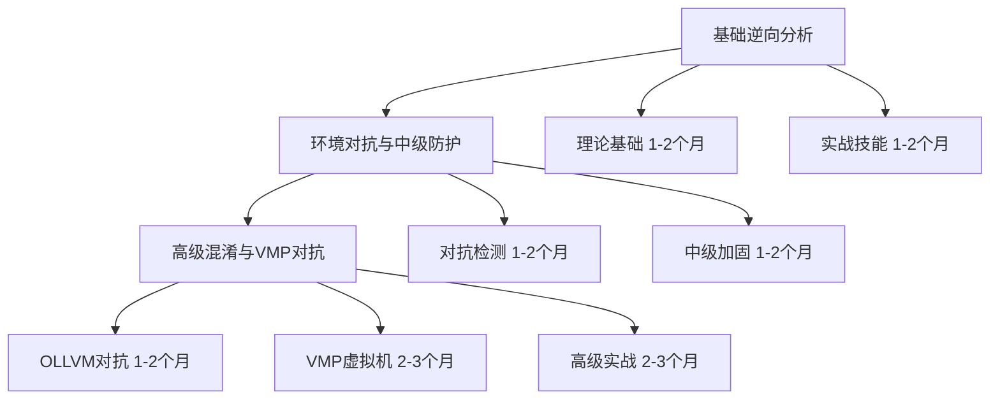
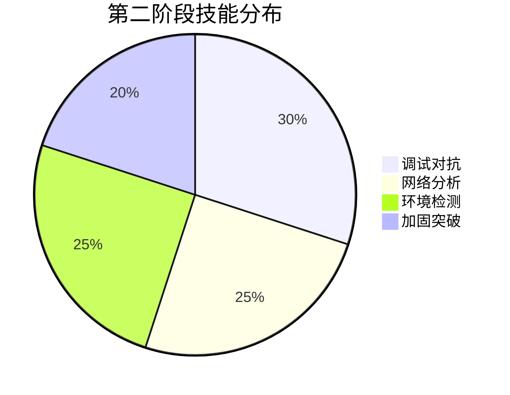
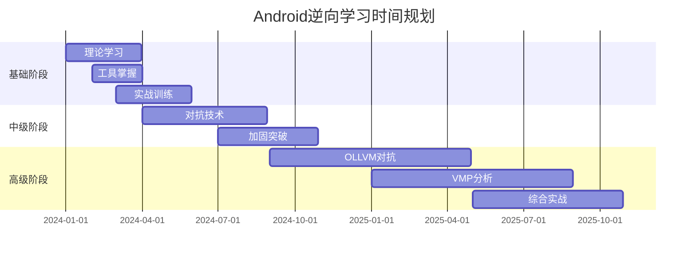

# Android逆向工程学习路线

## 学习路径总览

## 第一阶段：基础逆向分析能力（1-2个月）

### 核心技能框架

| 技能领域 | 主要工具 | 掌握程度 | 实战项目数量 |
|----------|----------|----------|-------------|
| Java/Kotlin分析 | Jadx, JD-GUI | 熟练 | 3-5个 |
| Native分析 | IDA Pro, Ghidra | 中级 | 2-3个 |
| 动态调试 | Frida, GDB | 基础 | 2-3个 |
| 文件分析 | APKTool, Hex编辑器 | 熟练 | 5-8个 |

### 学习重点

**Android系统架构深度理解**
- ART虚拟机运行机制与DEX格式解析
- JNI桥接技术与Native层交互
- 应用沙盒机制与权限管理

**反编译技术栈掌握**
- APKTool：完整APK逆向流程（解包→分析→重打包）
- 静态分析：代码逻辑理解、控制流分析
- 动态调试：运行时行为观察、参数监控

**实战技能训练**
- 代码混淆还原：字符串解密、控制流理解
- 关键功能定位：API调用追踪、交叉引用分析
- 简单保护绕过：授权验证、功能限制破解

## 第二阶段：环境对抗与中级防护突破（1-2个月）

### 对抗技术能力图

### 核心对抗技术

**调试检测绕过矩阵**

| 检测类型 | 常见技术 | 绕过策略 | 成功率 |
|----------|----------|----------|---------|
| 反调试 | ptrace检测 | 系统调用Hook | 90% |
| 时间检测 | 执行时间对比 | 时间伪造 | 85% |
| Frida检测 | 内存特征扫描 | 特征隐藏 | 80% |
| IDA检测 | 进程名识别 | 进程伪装 | 95% |

**网络分析对抗**
- SSL Pinning绕过：证书替换、Hook绕过
- 加密参数破解：sign算法逆向、时间戳验证
- 抓包检测对抗：代理隐藏、流量伪造

**环境检测全面突破**
- Root检测：多层隐藏技术、系统文件伪造
- 模拟器识别：硬件特征修改、传感器模拟
- Hook框架检测：内存清理、加载时机控制

## 第三阶段：高级混淆与VMP对抗（2-3个月）

### 技术难度递进图

### OLLVM对抗核心技术

**控制流重建策略**
- 基本块识别：入口点定位、边界确定
- 调度器分析：dispatcher逻辑理解
- 真实流程恢复：虚假分支剔除、路径合并

**工具链自动化**
- angr符号执行：路径探索、约束求解
- 自定义脚本：批量处理、模式识别
- 静动结合：静态分析+动态验证

### VMP虚拟机对抗

**虚拟化层次分析**

| 虚拟化层次 | 复杂度 | 分析重点 | 工具支持 |
|------------|--------|----------|----------|
| DEX字节码VMP | 高 | 指令映射 | 自研工具 |
| Native指令VMP | 极高 | 寄存器虚拟化 | IDA+脚本 |
| 混合VMP | 极高 | 双重解析 | 工具链整合 |

## 学习进度规划与职业发展

### 时间投入分配

### 技能评估标准

**基础阶段评估**
- 独立完成10个简单APP分析
- 掌握主流逆向工具使用
- 理解Android核心机制

**中级阶段评估**
- 突破5种以上检测机制
- 完成中等复杂度APP完整分析
- 开发自动化分析脚本

**高级阶段评估**
- 对抗OLLVM+VMP复合保护
- 分析商业级加固应用
- 独立开发专用工具

### 职业发展路径

**技术专家方向**
- 移动安全研究员：深入研究新型保护技术
- 安全工具开发：打造专业逆向分析平台
- 学术研究：发表相关论文、参与标准制定

**实战应用方向**
- 渗透测试专家：企业安全评估、红蓝对抗
- 安全顾问：为企业提供专业安全咨询
- 独立研究员：CTF竞赛、漏洞挖掘

## 学习建议

**渐进式学习策略**
- 每个阶段确保基础牢固再进入下一阶段
- 理论学习与实践并重，大量动手练习
- 建立错误笔记，总结分析失败经验

**资源获取与交流**
- 关注最新研究论文和技术博客
- 参与开源项目贡献代码
- 加入技术社区进行经验交流

通过科学的阶段划分和可量化的目标设定，帮助您系统性地掌握Android逆向工程技能。
