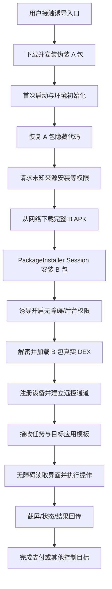
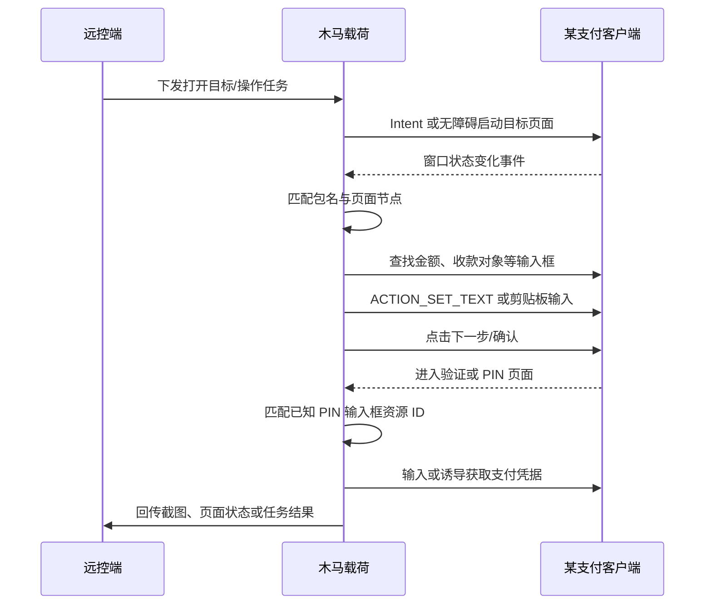
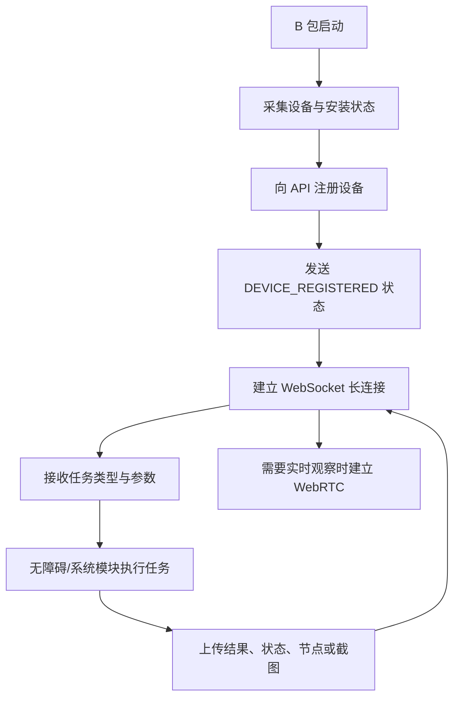

# 某 Android 远控转账木马的逆向分析：从 AB 包隐藏、动态加载到无障碍远程控制支付流程（abc.apk）

> 此样本、目标应用、域名、证书和基础设施信息均已脱敏。文中使用“某远控木马”“某支付客户端”“某金融 APP”作为代称。本文只记录已经从样本结构、反编译代码和测试现象中得到的结论；

## 0x00 写在前面

这次拿到的样本，第一眼看上去并不复杂：体积不大，界面伪装成普通娱乐类应用，Manifest 里甚至找不到无障碍服务。可实际测试却出现了一个明显矛盾——安装后产生的最终载荷能够通过无障碍控制某支付客户端，而且目标客户端没有按照预期给出拦截提示。

一开始我也把注意力放在包名伪装和 `android:isAccessibilityTool="true"` 上。后来做了一个对照 Demo：保留类似的系统应用风格包名，同样设置 `isAccessibilityTool=true`，结果依然会被目标客户端识别。这个实验基本排除了“只改两个静态字段就能绕过检测”的简单解释。

继续往下拆，整个样本实际上是两段式结构：

- A 包负责伪装、反分析、下载、安装和拉起；
- B 包才是远控与金融自动化载荷；
- A 包内部还有隐藏 DEX；
- B 包又套了一层 native + AES 加密 DEX；
- 真正的无障碍控制、屏幕传输、目标应用适配和运行时规避逻辑，都藏在 B 包解密后的 DEX 中。

下面是这次分析的完整复盘。

---

## 0x01 从攻击者视角看完整业务链

先不看类名和 API，站在攻击者的业务角度，这套木马要完成的是一个“设备接管—支付操作”的闭环。



### 最终业务目的是什么

从真实载荷中的功能组合看，它不是单纯的信息窃取器，也不是只做短信拦截的传统木马。它具备：

- 实时或准实时屏幕观察；
- 无障碍节点树采集；
- 坐标手势注入；
- 输入框写入；
- 全局返回、主页、最近任务等操作；
- 锁屏 PIN、密码、图案界面识别和自动化；
- 支付 PIN 仿冒界面；
- 针对多个金融应用的资源 ID 和流程适配；
- WebSocket/WebRTC 远程通信。

这些能力组合起来，最终目标很明确：让远端操作者像拿着受害者手机一样完成敏感业务操作，其中包括进入某支付客户端、定位支付页面、填写数据、点击确认并处理后续验证。

这里需要强调：静态代码能证明它具备完成上述闭环的技术条件，也能证明存在针对支付应用的专用适配；某一次真实攻击是否已经完成转账，仍需要服务器任务记录、受害设备日志或资金流水才能最终确认。

### 为什么选择无障碍

无障碍服务对攻击者的价值，在于它位于普通应用权限和系统输入机制之间：不需要 root，却可以看到大量 UI 状态，并代表用户执行操作。

对于金融木马来说，无障碍尤其适合解决三个问题：

1. **跨应用控制**：不需要注入目标进程，也不依赖目标应用导出组件。
2. **界面适配**：既可以按 View ID、文字和节点属性定位，也可以在节点不可见时退化为坐标手势。
3. **权限自动化**：可以帮助点击系统设置、权限对话框、电池优化页面，从而继续扩大控制能力。

样本还同时准备了截屏、屏幕投射和覆盖层。节点树负责“理解界面”，截图负责“让远端看到界面”，手势和 `performAction()` 负责“操作界面”，三者正好构成远控闭环。

### 普通用户为什么难以察觉

从用户视角看，隐蔽性不是靠单一技巧实现的，而是多个阶段叠加：

- 首次安装的是伪装 A 包，A 包本身没有在 Manifest 注册无障碍服务；
- 真正 B 包由 A 包后续下载并安装；
- B 包使用类似系统无障碍组件的包名和服务描述；
- 核心代码位于加密 DEX，普通查杀或静态检查难以直接看到金融自动化逻辑；
- 后台保活、开机启动和电池优化白名单延长了驻留时间；
- 操作可以发生在用户已经主动打开支付应用之后，看起来更像用户自己的输入；
- 根据代码推测，覆盖层和仿冒界面还可能遮挡真实页面或诱导用户提交凭据。

样本的传播来源没有保存在当前证据中。钓鱼网站、社交软件、短信链接或仿冒下载页都符合此类样本的常见传播方式，但对本样本只能标记为“根据代码和伪装形态推测”，不能当作已确认事实。

---

## 0x02 我是如何定位核心逻辑的

### 第一步：常规解包直接失败

最初用 apktool 解 A 包时，工具把部分条目判断为加密文件，Manifest 和 DEX 无法正常提取。进一步检查 ZIP 本地文件头和中央目录，发现几个异常：

- `AndroidManifest.xml` 和 `classes.dex` 带有虚假 encryption flag；
- 条目设置了 strong-encryption 相关标志；
- Manifest 本地文件头声明的未压缩尺寸约为 60 MB；
- 中央目录中的实际尺寸只有约 9.9 KB。

这不是普通打包器产生的误差，而是有意利用 ZIP 解析差异阻断工具链。修复本地头、中央目录和虚假标志后，apktool 才能正常反编译。

这个阶段给我的第一个提示是：样本真正想保护的内容不一定在表面 DEX 里。

### 第二步：Manifest 没有无障碍服务

A 包的 Manifest 中能看到：

- `REQUEST_INSTALL_PACKAGES`；
- 查询安装包权限；
- 网络权限；
- 前台服务；
- 一个 VPN Service 形式的组件；
- 自定义 `Application` 和 `AppComponentFactory`。

但没有 `BIND_ACCESSIBILITY_SERVICE` 对应的 Service 注册。这与动态测试中出现的无障碍控制能力矛盾，说明至少还存在第二阶段代码或第二个 APK。

### 第三步：跟进 Application 和 AppComponentFactory

自定义 `Application.attachBaseContext()` 调用了 native 方法，随后创建 `InMemoryDexClassLoader`。自定义 `AppComponentFactory` 又把 Activity、Application 等组件实例化交给恢复后的 ClassLoader。

等价逻辑可以概括为：

```java
byte[] hiddenDex = nativeRestore(context, disguisedAsset);
ClassLoader loader = new InMemoryDexClassLoader(
        ByteBuffer.wrap(hiddenDex),
        context.getClassLoader()
);

// AppComponentFactory 后续通过该 loader 实例化真正组件
Class<?> realClass = loader.loadClass(realComponentName);
```

其中一个原始资源伪装成普通字体文件，native 库负责恢复隐藏数据。A 包的加载方式更接近内存壳，不需要把第一层隐藏 DEX 以明显文件名落盘。

### 第四步：从配置中找到 B 包

A 包 assets 中的配置字符串采用 XOR `0x13` 混淆。恢复后可以得到：

- 远程配置地址；
- 安装器 API 基础地址；
- B 包目标包名；
- B 包启动 Action；
- Relay Activity；
- Base64 包裹的 B APK 下载地址。

真实域名和路径在公开文章中已脱敏，形式如下：

```text
https://<REMOTE_CONFIG_HOST>/<PATH>/config.json
https://<INSTALLER_API_HOST>/api
https://<OBJECT_STORAGE_HOST>/<LONG_PATH>/payload.apk
```

下载内容是完整 APK，不是单独 DEX。A 包随后使用 `PackageInstaller.Session` 安装它。因此要区分两个概念：

- A 包内部确实动态加载隐藏 DEX；
- 但 A 到 B 的交付方式是“下载并安装完整 APK”，不是仅把 B 当作内存 DEX 执行。

### 第五步：B 包外层仍然不是最终代码

B 包 Manifest 已经出现真正的 AccessibilityService，但表层 DEX 的业务逻辑仍然不完整。沿着 `ShellLoader`、`PayloadClassLoader` 和 native 调用继续追踪，最后定位到：

```text
assets/zi8j2dcl
```

这是一个约 12.48 MB 的加密文件。native 库返回 32 字节密钥，代码使用：

```text
AES/CBC/PKCS5Padding
```

密文前 16 字节作为 IV。解密后得到标准 DEX，再由 `DexClassLoader` 加载。

等价流程如下：

```java
byte[] blob = readAsset("zi8j2dcl");
byte[] iv = Arrays.copyOfRange(blob, 0, 16);
byte[] ciphertext = Arrays.copyOfRange(blob, 16, blob.length);

SecretKeySpec key = new SecretKeySpec(nativeGetKey(), "AES");
Cipher cipher = Cipher.getInstance("AES/CBC/PKCS5Padding");
cipher.init(Cipher.DECRYPT_MODE, key, new IvParameterSpec(iv));
byte[] realDex = cipher.doFinal(ciphertext);

// 写入应用私有目录后交给 DexClassLoader
DexClassLoader loader = new DexClassLoader(
        dexPath, optimizedDir, nativeLibDir, parentLoader);
```

到了这一步，真正的远控、无障碍和金融应用适配代码才完整出现。

---

## 0x03 AB 包与双层动态加载

整套加载链可以画成下面这样：


### A 包承担什么角色

A 包更像投递器和安装器。它的表面名称、图标和启动页用于降低用户警觉；技术上负责：

- 阻碍初步解包；
- 加载隐藏安装逻辑；
- 获取远程配置；
- 下载 B APK；
- 发起未知来源安装；
- 安装后通过预设 Action 或 Relay Activity 拉起 B 包。

A、B 使用不同包名和不同签名，进一步降低了基于单一 APK 哈希或签名进行关联的效果。

### B 包为什么还要再套一层

B 包必须在 Manifest 中声明无障碍服务，所以它无法彻底隐藏“存在无障碍组件”这一事实。但它仍然可以隐藏“这个服务具体做什么”。

外层扫描器可能只看到：

- 一个名称像系统辅助功能的包；
- 一个声明完整、`isAccessibilityTool=true` 的无障碍服务；
- 一些加载器和框架代码。

只有解开第二层 DEX，才会看到：

- 支付应用包名和资源 ID；
- PIN 输入框处理；
- 锁屏自动化；
- 远程任务执行；
- 黑色覆盖层；
- 屏幕共享；
- 针对目标应用动态修改 `AccessibilityServiceInfo`。

这对依赖关键词、调用图或表层 DEX 特征的扫描器非常有效。

---

## 0x04 B 包核心功能

### 4.1 无障碍服务配置

B 包通过标准方式注册 `AccessibilityService`，运行在独立的 `:control` 进程，并要求：

```xml
android:permission="android.permission.BIND_ACCESSIBILITY_SERVICE"
```

其 XML 配置包含：

```xml
<accessibility-service
    android:accessibilityEventTypes="...全部主要事件类型..."
    android:accessibilityFeedbackType="feedbackSpoken|feedbackHaptic|feedbackAudible|feedbackVisual|feedbackGeneric"
    android:notificationTimeout="0"
    android:accessibilityFlags="flagDefault|flagRequestEnhancedWebAccessibility|flagReportViewIds|flagRequestFilterKeyEvents|flagRetrieveInteractiveWindows"
    android:canRetrieveWindowContent="true"
    android:canRequestTouchExplorationMode="true"
    android:canRequestEnhancedWebAccessibility="true"
    android:canRequestFilterKeyEvents="true"
    android:canPerformGestures="true"
    android:canTakeScreenshot="true"
    android:isAccessibilityTool="true"
    android:accessibilityDataSensitive="no" />
```

从权限设计就能看出，这个服务不是只为读屏准备的：节点读取、Web 内容、按键过滤、交互窗口、手势和截图能力都被打开。

### 4.2 如何监听界面变化

真实服务会处理窗口状态、窗口内容、点击、文本变化、滚动、焦点变化等事件。核心信息来自：

```java
CharSequence pkg = event.getPackageName();
int type = event.getEventType();
AccessibilityNodeInfo root = getRootInActiveWindow();
List<AccessibilityWindowInfo> windows = getWindows();
```

它把节点的以下属性序列化，供本地规则或远端操作者判断：

- text；
- contentDescription；
- viewIdResourceName；
- bounds；
- clickable、focusable、editable；
- className、packageName；
- 子节点结构。

这相当于把当前 Android 界面转换成一棵可搜索、可远程决策的 UI 树。

### 4.3 如何定位和操作控件

样本同时采用三类定位方式：

1. **资源 ID 定位**：适合版本固定、控件 ID 稳定的金融应用。
2. **文本和描述定位**：适合“确认”“下一步”“允许”等系统或业务按钮。
3. **坐标手势**：节点不可点击、WebView 隐藏结构或自绘控件时使用。

等价控制代码类似：

```java
List<AccessibilityNodeInfo> nodes =
        root.findAccessibilityNodeInfosByViewId(targetViewId);

AccessibilityNodeInfo node = nodes.isEmpty() ? null : nodes.get(0);
if (node != null && node.isEditable()) {
    Bundle args = new Bundle();
    args.putCharSequence(
            AccessibilityNodeInfo.ACTION_ARGUMENT_SET_TEXT_CHARSEQUENCE,
            value);
    node.performAction(AccessibilityNodeInfo.ACTION_SET_TEXT, args);
}

if (node != null && node.isClickable()) {
    node.performAction(AccessibilityNodeInfo.ACTION_CLICK);
} else {
    dispatchGesture(buildTapGesture(x, y), callback, null);
}
```

### 4.4 支付流程如何闭环

真实代码中硬编码了某支付客户端的包名、PIN 输入框 ID，并保留其他钱包的同类 ID，说明开发者为不同目标设计了独立适配。

一个符合代码能力的任务流程大致是：



这里“金额字段、收款对象字段的具体资源 ID”和完整转账任务结构尚未全部完成字段级还原，因此流程中的部分字段属于根据能力和页面适配代码作出的推测。已确认的是：目标包匹配、PIN 输入框匹配、节点控制、手势控制、截图和任务执行框架同时存在。

### 4.5 锁屏、权限和覆盖层

服务还包含锁屏 PIN、密码和图案识别逻辑。这类功能可能用于：

- 在受害者不操作时解锁设备；
- 在远控期间恢复被系统中断的会话；
- 收集或复用设备凭据。

此外，样本存在黑色覆盖层、Credential 模拟 Activity 和 Payment PIN 模拟 Activity。根据代码推测，覆盖层既可以遮挡远控操作，也可以把用户导向仿冒输入界面。其与某一次支付任务的精确触发关系仍待动态验证。

---

## 0x05 远控通信机制

### 已确认的通信通道

从 A/B 两阶段代码可以确认：

- A 包通过 HTTPS 获取远程配置和下载 B APK；
- B 包包含 WebSocket 命令通信；
- B 包包含 WebRTC/MediaProjection 屏幕传输能力；
- B 包存在设备注册完成广播和任务执行框架。

没有发现 MQTT 是主要通信方式的确凿证据。也没有证据表明它使用裸 TCP Socket 取代 WebSocket。当前最符合代码的结构是：HTTPS 用于配置、注册或普通 API，WebSocket 用于实时命令，WebRTC 用于屏幕流。

### 通信流程



### 请求参数和指令格式

本次已经确认远程 API 基础地址、设备注册动作、WebSocket/WebRTC 模块和大量任务执行入口，但没有完成全部网络 DTO、JSON 字段和服务端响应枚举的系统还原，也没有保存足以逐字段复现协议的完整抓包。

因此，以下内容必须标记为待进一步验证：

- 设备唯一标识究竟使用 Android ID、安装 UUID、硬件信息还是组合哈希；
- 注册接口的准确路径和所有请求字段；
- WebSocket 鉴权 Token 的来源和刷新方式；
- 每一种远控任务的 JSON schema；
- 任务结果和错误码结构；
- 业务层是否还叠加额外加密或签名。

不能因为代码中存在通用 JSON/HTTP 库，就自行补出类似 `deviceId`、`command`、`payload` 的字段。若继续研究，应该从 WebSocket `send/onMessage`、HTTP RequestBody 构造和 DTO 序列化入口向两侧建立调用图，再结合代理抓包或方法 Hook 验证。

---

## 0x06 针对目标应用的识别与模板

文章中不公开真实目标名称和包名，统一表示为：

```java
private static final String TARGET_WALLET_PACKAGE =
        "<TARGET_WALLET_PACKAGE>";
```

真实载荷维护了一个目标包名集合，并在无障碍事件处理过程中取得当前事件来源包名。逻辑可以还原为：

```java
String foregroundPackage = String.valueOf(event.getPackageName());
boolean targetForeground = TARGET_PACKAGES.contains(foregroundPackage);

if (targetForeground != previousTargetForeground) {
    previousTargetForeground = targetForeground;
    applyAccessibilityProfile(
            targetForeground ? "target_enter" : "target_leave");
}
```

它不是通过进程注入判断目标，也没有发现必须依赖 UsageStats 权限。主要前台信号来自 `AccessibilityEvent.getPackageName()`；代码还结合锁屏、覆盖层和内部模块状态，避免某些非业务窗口触发错误切换。

除了包名，样本还保存多个钱包的输入框资源 ID，其中至少包括某支付客户端的 PIN 输入框。由此可以判断它存在按应用区分的流程模板，而不是只把整部手机当作一块远程触摸屏。

任务模板的完整配置来源尚未全部还原：一部分规则直接硬编码在 DEX，一部分参数可能由远端任务下发。两者的边界待进一步验证。

---

## 0x07 无障碍反检测：真正值得注意的地方

### 7.1 包名伪装和 `isAccessibilityTool`

B 包使用了类似系统辅助功能组件的命名空间，服务描述也更像正常辅助工具。Manifest 同时声明：

```xml
android:isAccessibilityTool="true"
```

这两项确实能降低用户警觉，并可能绕过只做包名关键词或简单类型判断的实现。但 B 包证书不是对应系统厂商的官方证书，严格检查签名时不应被信任。

更关键的是，对照 Demo 已经验证：只复制类似包名和 `isAccessibilityTool=true`，某支付客户端仍会检测。这意味着真正差异还在运行时状态或其他环境因素中。

### 7.2 服务连接后重建 `AccessibilityServiceInfo`

木马在 `onServiceConnected()` 中新建 `AccessibilityServiceInfo`，而不是完全沿用 XML 解析结果：

```java
AccessibilityServiceInfo info = new AccessibilityServiceInfo();
info.flags = 0x7d;
info.eventTypes = 0x1ffffff;
info.notificationTimeout = 0L;
info.packageNames = null;
info.feedbackType = 0x3d;
setServiceInfo(info);
```

`packageNames=null` 表示接收所有包的事件。`0x7d` 包含：

- `FLAG_DEFAULT`；
- `FLAG_REQUEST_TOUCH_EXPLORATION_MODE`；
- `FLAG_REQUEST_ENHANCED_WEB_ACCESSIBILITY`；
- `FLAG_REPORT_VIEW_IDS`；
- `FLAG_REQUEST_FILTER_KEY_EVENTS`；
- `FLAG_RETRIEVE_INTERACTIVE_WINDOWS`。

值得注意的是，`0x7d` 不包含 `FLAG_INCLUDE_NOT_IMPORTANT_VIEWS`（`0x2`）。

### 7.3 目标应用进入前台时动态清除 `0x2`

这是本次分析中最明确的目标应用专用规避逻辑。

真实代码维护一个类似 `targetForeground` 的状态。当前台包名命中目标集合时：

1. 设置目标应用前台标志；
2. 记录 `target_enter` 日志标签；
3. 调用状态解析函数；
4. 强制“不重要 View”策略解析为 `false`；
5. 读取当前 `AccessibilityServiceInfo`；
6. 清除 `0x2`；
7. 调用 `setServiceInfo()` 立即提交。

等价代码：

```java
private void onForegroundPackageChanged(String packageName) {
    boolean inTarget = TARGET_PACKAGES.contains(packageName);
    if (inTarget == targetForeground) {
        return;
    }

    targetForeground = inTarget;
    applyNotImportantViewsPolicy(
            inTarget ? "target_enter" : "target_leave");
}

private void applyNotImportantViewsPolicy(String reason) {
    AccessibilityServiceInfo info = getServiceInfo();
    if (info == null) {
        return;
    }

    boolean includeNotImportantViews = resolvePolicy();
    if (includeNotImportantViews) {
        info.flags |= AccessibilityServiceInfo.FLAG_INCLUDE_NOT_IMPORTANT_VIEWS;
    } else {
        info.flags &= ~AccessibilityServiceInfo.FLAG_INCLUDE_NOT_IMPORTANT_VIEWS;
    }
    setServiceInfo(info);
}

private boolean resolvePolicy() {
    if (forcedValue != null) {
        return forcedValue;
    }
    if (targetForeground) {
        return false;
    }
    if (temporaryValue != null) {
        return temporaryValue;
    }
    return defaultValue;
}
```

这说明开发者主动关注“目标应用查询到的运行时无障碍 flags”，并按前台应用动态缩减暴露能力。

### 7.4 清除 `FLAG_INCLUDE_NOT_IMPORTANT_VIEWS` 后还能做什么

清除 `0x2` 不等于关闭无障碍。它只是不再要求 Framework 把标记为“对无障碍不重要”的 View 全部暴露给服务。木马仍然保留：

- 重要节点和活动窗口读取；
- View ID 报告；
- 交互窗口检索；
- `ACTION_SET_TEXT`；
- `performAction()`；
- `dispatchGesture()`；
- 全局动作；
- 截图。

对于已经知道关键资源 ID、同时拥有坐标手势后备方案的木马，这种交换很划算：减少一个明显的高风险特征，却不明显破坏支付流程控制。

### 7.5 这是不是绕过的唯一原因

目前不能这样下结论。

静态代码已经证明目标应用前台会触发 `flags &= ~0x2`。但这一动作不会把服务从以下位置删除：

- `Settings.Secure.enabled_accessibility_services`；
- `AccessibilityManager.getEnabledAccessibilityServiceList()`；
- PackageManager 可查询的 Service 和 Manifest 元数据。

因此，如果某金融 APP 的策略只是“发现任何非白名单无障碍服务就拦截”，清除 `0x2` 理论上不够。

结合当前测试现象，更合理的几个假设是：

- 目标客户端使用运行时 flags/capabilities 做风险评分，而不是一刀切；
- 包名、`isAccessibilityTool`、运行时 flags、安装来源或签名信誉共同参与判断；
- 木马可能在警告出现后通过无障碍快速关闭或绕开提示；
- 木马的覆盖层可能让测试人员看不到真实提示；
- 被测客户端版本、系统版本或安全 SDK 配置存在差异。

以上均为待进一步验证。现阶段最严谨的结论是：**木马存在明确的目标应用感知和运行时无障碍特征降级机制，但尚未证明它是完整绕过链的唯一环节。**

### 7.6 触摸探索动态开关

代码还会动态设置或清除 `FLAG_REQUEST_TOUCH_EXPLORATION_MODE`（`0x4`），并维护触摸探索、收集状态和屏幕区域。它与覆盖层触摸控制、手势任务和人工接管有关。

目前没有足够证据证明 `0x4` 的切换专门用于绕过某金融 APP 检测，所以应把它记录为“相关运行时变形能力”，而不是直接认定为目标专用规避。

---

## 0x08 权限获取与用户侧执行过程

### 未知来源安装

A 包声明 `REQUEST_INSTALL_PACKAGES`，B 包通过完整 APK 交付，因此设备必须允许对应来源安装应用。系统不会在完全无交互的普通权限模型下静默批准第三方安装。

根据代码推测，A 包会通过界面引导和无障碍/安装 Relay 流程减少用户操作步骤，但在非 root、非设备所有者场景中，首次授权仍需要用户参与。

### 无障碍权限

无障碍授权同样需要用户在系统设置中主动打开。攻击者通常会用“修复服务”“辅助操作”“省电”“更新组件”等理由诱导开启；本样本具体使用了哪段社会工程文案，当前材料不足，待进一步验证。

### 后台与电池优化

样本包含前台服务、开机接收、唤醒锁和忽略电池优化相关逻辑。目的很直接：

- 避免进程被后台限制快速回收；
- 重启后恢复控制；
- 保持 WebSocket 和屏幕传输；
- 在用户不主动打开木马界面时继续监听目标应用。

### 悬浮层与屏幕投射

覆盖层用于遮挡、提示或仿冒；MediaProjection/WebRTC 用于远端观察。屏幕投射授权通常会触发系统确认，本样本如何在不同 Android 版本上获取和维持授权，需要结合实际设备继续动态验证。

---

## 0x09 Android 环境检测情况

逆向过程中重点搜索了 root、调试、模拟器、Hook 框架、VPN、代理和自动化相关逻辑。

### 已确认

- A 包注册一个 VPN Service 形式的组件；
- B 包会检查自身无障碍服务是否仍存在于 `enabled_accessibility_services`；
- B 包包含运行状态、权限状态、前台应用和已安装敏感应用检查；
- B 包保留一个 UiAutomator/ADB 相关 Provider，但当前实现直接抛出 `ADB automation is disabled`。

### 尚未确认

没有获得足够证据证明当前版本具备完整的：

- root 检测；
- Frida/Xposed 等 Hook 框架检测；
- 模拟器硬件指纹检测；
- 调试器附加检测；
- 证书 Pinning 对抗代理抓包；
- VPN/代理环境下拒绝运行。

A 包出现 VPN Service 组件不等于它一定在做“VPN 环境检测”，也可能用于网络通道或安装流程配套。没有调用链和动态流量支持时，不能仅根据组件名下结论。

---

## 0x0A 动态测试中最值得复现的对照

当前测试已经给出一个非常有价值的事实：

- 原始木马能够控制某支付客户端，测试时未观察到预期拦截；
- 自研 Demo 使用类似系统包名并设置 `isAccessibilityTool=true`，仍会被检测。

但目前没有一份完整、逐时刻保存的原始 logcat、系统服务 dump 和网络抓包可供文章逐行引用。因此本文不把静态代码中的 `target_enter` 日志字符串冒充为已经采集到的动态日志。

下一步最有效的实验不是继续猜包名，而是固定同一台设备、同一系统版本、同一目标客户端版本，记录以下数据：

```text
1. 无障碍服务刚连接
2. 桌面位于前台
3. 目标支付客户端启动
4. 进入 PIN/确认页面
5. 离开目标客户端
```

每个时刻记录：

```java
AccessibilityServiceInfo info = getServiceInfo();
Log.i(TAG, "flags=0x" + Integer.toHexString(info.flags));
Log.i(TAG, "eventTypes=0x" + Integer.toHexString(info.eventTypes));
Log.i(TAG, "feedbackType=0x" + Integer.toHexString(info.feedbackType));
Log.i(TAG, "capabilities=0x" + Integer.toHexString(info.getCapabilities()));
Log.i(TAG, "packages=" + Arrays.toString(info.packageNames));
```

然后按单变量方式测试：

1. 只修改包名；
2. 增加 `isAccessibilityTool=true`；
3. 连接时重建 `ServiceInfo`，令 `flags=0x7d`；
4. 进入目标应用时清除 `0x2`；
5. 分别移除 `0x4/0x8/0x10/0x20/0x40`；
6. 保持 ServiceInfo 相同，只替换签名和安装来源；
7. 观察警告是否出现后被自动点击、返回或覆盖。

只有这样，才能把“代码里存在的规避动作”和“目标客户端真正采用的检测条件”闭环起来。

---

## 0x0B 防御建议

### 对普通用户

- 不从聊天链接、短网址或仿冒下载页安装 APK；
- 对“娱乐工具却要求安装其他应用”的行为保持警惕；
- 不因“更新、修复、辅助、自动点击”等理由随意开启无障碍；
- 定期检查无障碍服务、设备管理器、悬浮窗、通知读取和未知来源安装权限；
- 发现陌生辅助服务时，先断网，再关闭服务并卸载相关应用；
- 金融操作异常、页面被遮挡或手机出现自动点击时，应立即冻结账户并使用另一台可信设备修改凭据。

### 对 Android 开发者

不要只依赖包名或 `isAccessibilityTool` 判断无障碍服务是否可信。至少组合检查：

- 已启用服务的组件名；
- APK 签名证书；
- 安装来源；
- `AccessibilityServiceInfo.flags` 和 capabilities；
- Service 的 Manifest 元数据；
- 前后台切换时 ServiceInfo 是否突然变化；
- 是否存在可疑覆盖层、屏幕共享或自动输入行为。

对高风险支付页面：

- 尽量减少通过稳定资源 ID 暴露敏感输入流程；
- 对敏感节点使用平台提供的数据敏感属性，但要充分测试合法辅助工具兼容性；
- 对关键交易采用服务端风控、设备绑定和二次确认，不能把客户端无障碍检测当作唯一防线；
- 检测逻辑应校验官方辅助工具的签名，而不是信任某个包名前缀；
- 在交易确认前再次校验收款对象、金额、操作节奏和设备环境。

还要考虑动态变形：目标应用进入前台后重新查询 ServiceInfo，并与进入前快照比较。如果某服务恰好在金融应用前台时移除高风险 flags，这个行为本身就是强风险信号。

### 对安全研究人员

- 解包失败时先检查 ZIP 本地头和中央目录差异，不要立即认定文件损坏；
- 同时检查 Application、AppComponentFactory、ContentProvider 和 native 初始化入口；
- 对伪装成字体、图片、数据库的高熵 assets 做熵值和文件头分析；
- 搜索 `InMemoryDexClassLoader`、`DexClassLoader`、`Cipher.getInstance`、`setServiceInfo`；
- 不要只看 Manifest 声明的 flags，要观察运行时 flags；
- 针对金融木马，优先搜索包名、资源 ID、PIN、金额、确认、Intent 组件和任务枚举；
- 网络协议必须结合 DTO 构造、发送入口和动态抓包，不要凭通用网络库猜字段；
- 记录样本每一层的哈希、签名、加载入口和解密产物，避免把 A/B 包行为混为一谈。

---

## 0x0C 关键技术点汇总

| 方向  | 已确认技术 | 安全意义 |
| --- | --- | --- |
| A 包反分析 | ZIP 虚假加密标志、异常长度 | 阻断常规解包和批量扫描 |
| A 包加载 | native 恢复资源、`InMemoryDexClassLoader` | 隐藏投递与安装逻辑 |
| AB 交付 | HTTPS 下载完整 B APK、PackageInstaller Session | 分离诱饵与真实载荷 |
| B 包加壳 | native 密钥、AES/CBC/PKCS5Padding | 隐藏真实远控 DEX |
| B 包加载 | `DexClassLoader` | 运行期加载核心代码 |
| 无障碍控制 | 节点树、View ID、文本、点击、手势、全局动作 | 无 root 跨应用控制 |
| 屏幕远控 | MediaProjection、WebRTC | 远端观察受害设备 |
| 命令通道 | HTTPS、WebSocket | 注册、任务下发与结果回传 |
| 金融适配 | 目标包集合、PIN 输入框 ID、显式组件 | 按应用定制控制流程 |
| 静态伪装 | 系统风格包名、`isAccessibilityTool=true` | 降低用户和简陋规则警觉 |
| 动态规避 | 重建 ServiceInfo、目标前台清除 `0x2` | 降低运行时能力特征 |
| 待验证项 | 安装信誉、签名策略、警告自动处理、完整 C2 schema | 需要动态实验闭环 |

---

## 0x0D 结语

这次样本最有意思的地方，不是某一个“高深”的 API，而是攻击者把多个普通机制拼成了一条完整业务链：ZIP 反分析拖慢第一轮检查，内存 DEX 隐藏 A 包逻辑，A/B 包切断诱饵和载荷关联，B 包再用 AES DEX 隐藏真实功能，最后依靠无障碍、屏幕传输和目标应用模板完成远程控制。

无障碍绕过部分也比“伪装包名”复杂。样本确实声明了 `isAccessibilityTool=true`，也确实使用了类似系统组件的命名，但真正值得关注的是它会识别目标支付客户端进入前台，并立即改变运行时 `AccessibilityServiceInfo`，确保 `FLAG_INCLUDE_NOT_IMPORTANT_VIEWS` 被清除。这是明确写在代码里的目标感知降权动作。

同时也要克制结论：清除一个 flag 不会让服务从 Android Framework 中消失。它为什么能在特定测试环境下不触发目标客户端的预期检测，仍可能涉及目标版本的风险评分、签名和安装来源、其他 flags、远程配置，甚至警告出现后的自动处理。没有动态调用证据之前，不能把其中任意一项写成唯一答案。

对防守方来说，最直接的启示是：不要只在应用启动时做一次静态无障碍枚举，更不要把包名和 `isAccessibilityTool` 当成信任依据。服务会在目标应用前后台切换时改变自己。检测逻辑也必须从“有没有无障碍”升级为“哪个签名的服务、在什么时候、以什么能力组合、为什么突然发生变化”。
